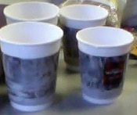

#returnofthecups



This repository contains code to ultimately detect, locate and track coffee cups in such a manner that a RRR manipulator can pick up the cups in turn and move them to various dispensing locations. It contains standalone code for the vision and the manipulator as well as the main program which combiens them.

---

###INSTALLATION


1. opencv
2. libfreenect

Preferably use a package manager (use homebrew on OSX) - this ensures that dependencies
are correctly installed.

---

###FILES

#####Vision

* device.cpp / device.h : the abstracted freenect device class
* cups.cpp / cups.h : functions to help identify and located cups
* main.cpp : the main program


####Robot

```
Andy add stuff here about things
```

---

###Notes

Currently the dynamixel code runs only on __Linux__. The vision code compiles and runs on both __Linux__ and __OSX__.
